## Thông tin sinh viên
- Họ và tên: Nguyễn Hoàng Việt
- Mã sinh viên: 23810310438

splashscreen
onboarding
signin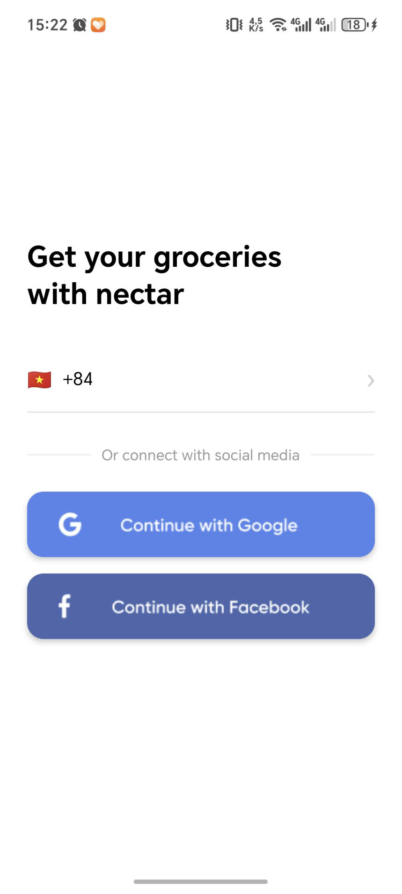
number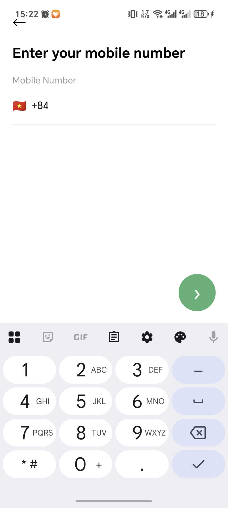
verification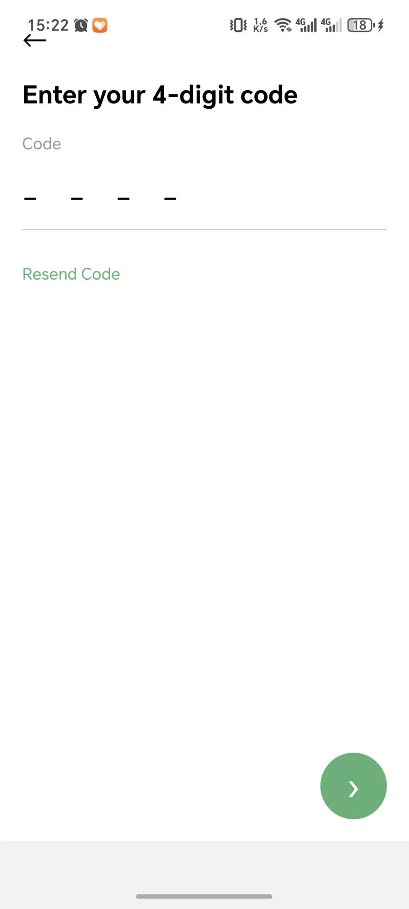
select location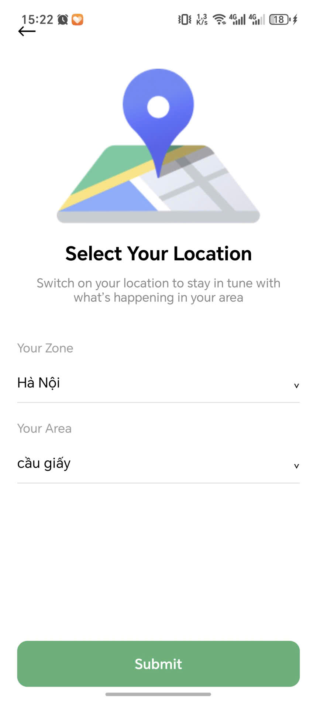
log in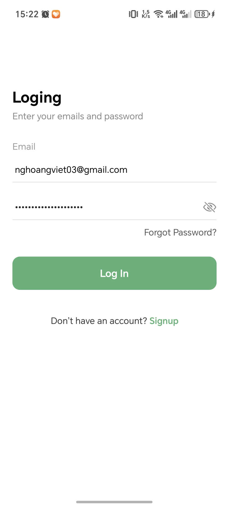
sign up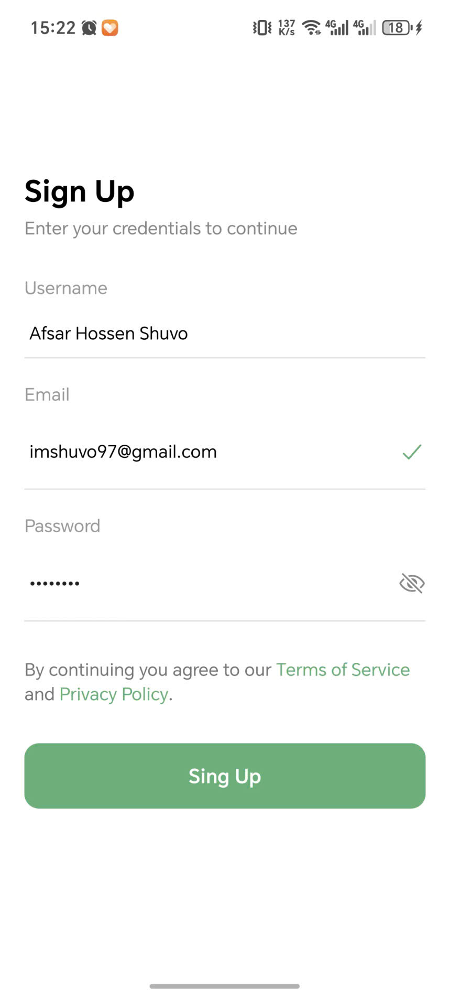
homescreen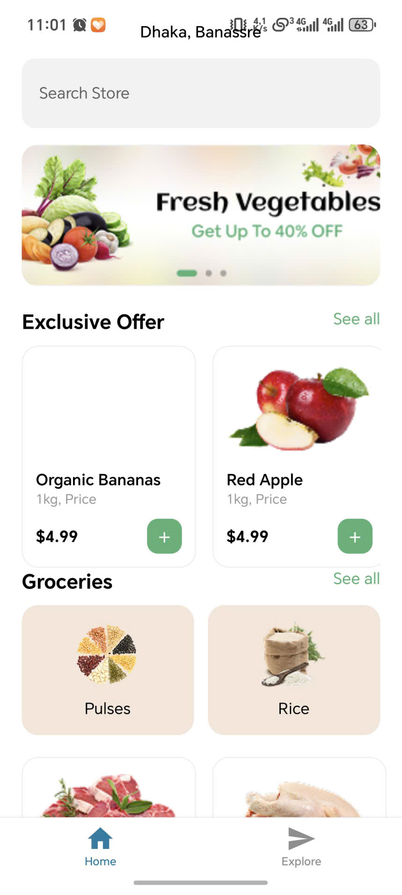
product detail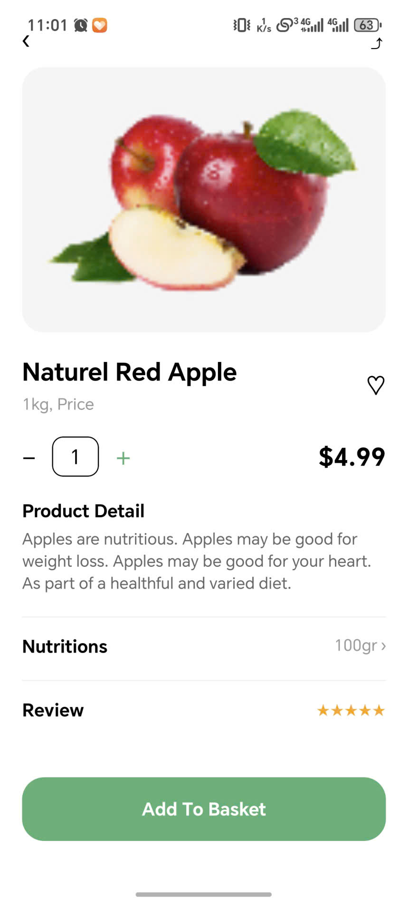
explore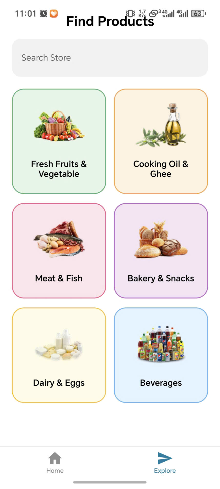
beverages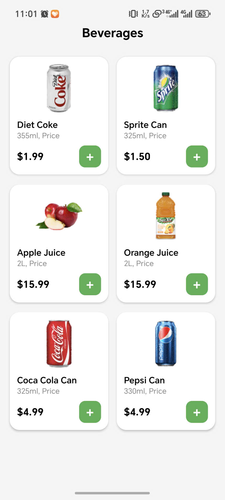
<b>update:P4-06/04/2026<b>
search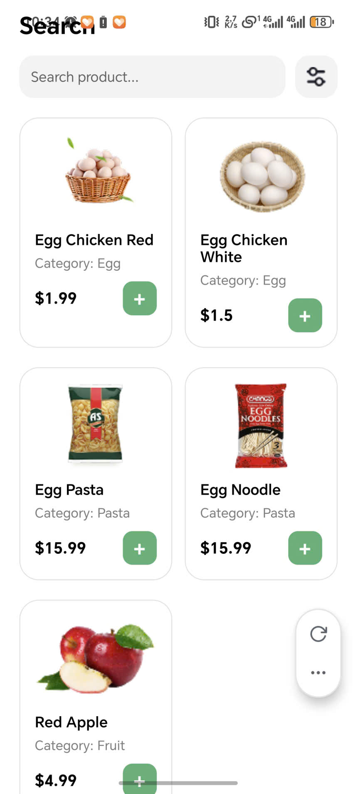
filter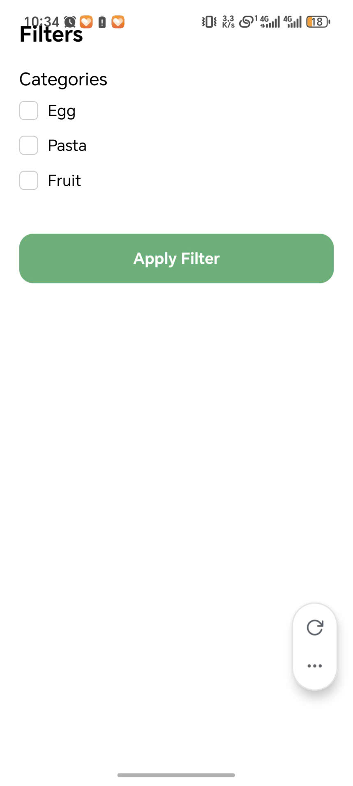
mycart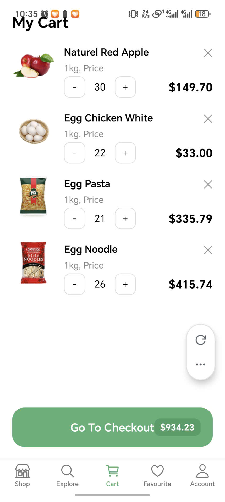
favourite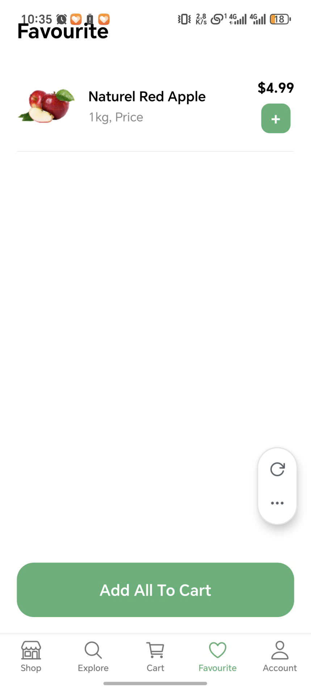
<b>update:P4-10/04/2026<b>
checkout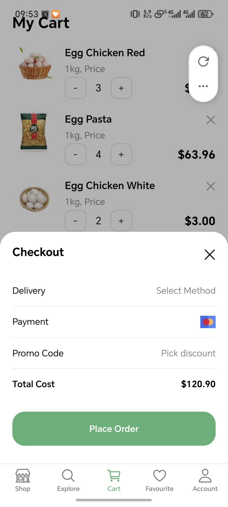
order_accepted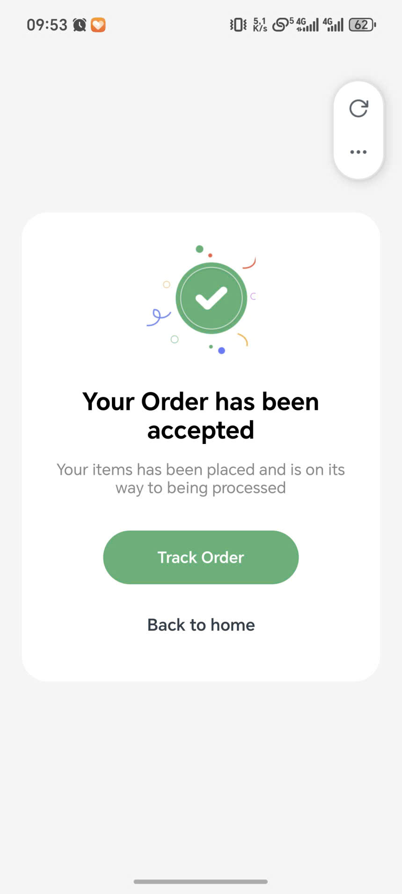
error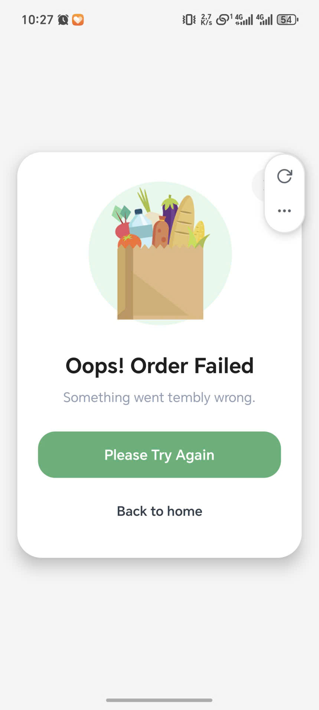
account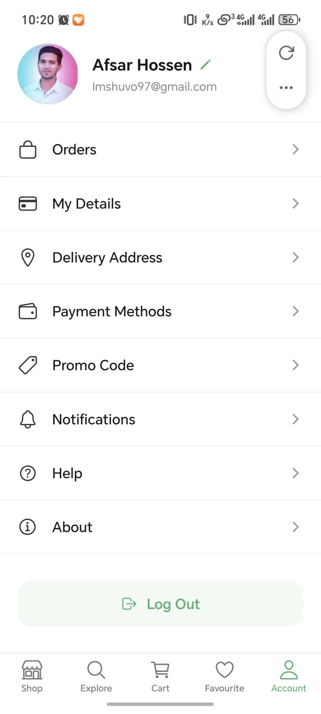
##video thao tác
[▶️ Xem video thao tác bình thường](./vid.mp4) https://drive.google.com/file/d/1aCML3nm3-udt54kBzunWaQ8vwqRBnsce/view?usp=sharing
[▶️ Xem video kill app](./vid2.mp4) https://drive.google.com/file/d/1BfvBOUJkLCzH2OPYG4p-a2cB5HkUViDP/view?usp=sharing 
1. AsyncStorage hoạt động như thế nào?
AsyncStorage là một kho lưu trữ key-value trên thiết bị di động.
Dữ liệu được lưu lại vĩnh viễn trong bộ nhớ local của app, nên tắt mở app vẫn còn.
Cách dùng:
   AsyncStorage.setItem(key, value) để lưu
   AsyncStorage.getItem(key) để đọc
   AsyncStorage.removeItem(key) để xóa
   Vì là async nên trả về Promise, nên cần await hoặc then.
Dữ liệu ở dạng chuỗi (string), nên nếu muốn lưu object phải JSON.stringify lúc lưu và JSON.parse lúc đọc.
2. Vì sao dùng AsyncStorage thay vì biến state?
state chỉ tồn tại trong thời gian chạy của component/page.
Khi app reload, chuyển screen, hoặc đóng app thì state mất.
   AsyncStorage lưu dữ liệu lâu dài:
phù hợp với token, thông tin user,
giỏ hàng cần giữ khi đóng app,
trạng thái đã login để auto login.
state tốt cho hiển thị UI tạm thời, tương tác nhanh, còn AsyncStorage tốt cho dữ liệu cần “giữ lâu”.
3. So sánh với Context API
- Mục đích:
  - AsyncStorage: Lưu dữ liệu lâu dài trên thiết bị.
  - Context API: Chia sẻ state giữa các component trong React.
- Thời gian tồn tại:
  - AsyncStorage: Qua nhiều phiên chạy app.
  - Context API: Chỉ trong phiên hiện tại, mất khi reload app.
- Phạm vi:
  - AsyncStorage: Toàn bộ app, nhiều lần mở app.
  - Context API: Trong cây component React hiện tại.
- Dữ liệu phù hợp:
  - AsyncStorage: Token, user info, giỏ hàng, cài đặt.
  - Context API: Theme, auth current state, UI state, dữ liệu dùng nhiều component.
- Cách truy cập:
  - AsyncStorage: Async, cần await.
  - Context API: Đồng bộ, hook useContext.
- Không nên dùng:
  - AsyncStorage: Không dùng để render state tạm thời ngay lập tức nếu chỉ cần trong session.
  - Context API: Không dùng để lưu dữ liệu lâu dài khi app đóng.